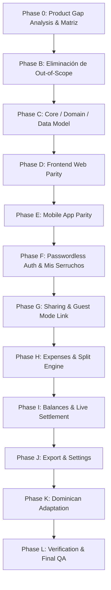

# 🪚 SERRUCHO — Kittysplit Product Parity Migration Plan

Este plan maestro establece la hoja de ruta fase por fase para transformar el producto **Serrucho** hacia la paridad funcional, estructural y de experiencia de usuario con **Kittysplit**, conservando la identidad, arquitectura técnica, motor de dominio `@serrucho/core`, soporte offline y adaptación a República Dominicana.

---

## Fases de la Migración

---

### Fase 0 — Product Gap Analysis & Auditoría (Actual)
* **Objetivo:** Inspección total de Serrucho vs Kittysplit sin modificar código.
* **Entregables:**
  * `Agents/Migration/KITTY_SPLIT_PARITY_MATRIX.md`
  * `Agents/Migration/KITTY_SPLIT_REMOVALS.md`
  * `Agents/Migration/KITTY_SPLIT_DECISIONS.md`
  * `Agents/Migration/KITTY_SPLIT_MIGRATION_PLAN.md`
* **Checkpoint:** Esperar confirmación de decisiones antes de continuar a la Fase B.

---

### Fase B — Eliminación de Funcionalidades Fuera de Alcance
* **Objetivo:** Limpieza limpia y de extremo a extremo de elementos no existentes en Kittysplit.
* **Alcance:**
  * Eliminar Calculadora independiente (`/calculadora`, `QuickSplitCalculator`, `calculator.tsx`).
  * Eliminar Premios del Coro (`coro-awards-card.tsx`, `awards.tsx`, tipos asociados).
  * Eliminar generador de historias de Instagram (`shareable-story-dialog.tsx`).
  * Eliminar asistente de cierre inmutable (`close-serrucho-wizard.tsx`).
* **Puerta de Calidad:** `npm run typecheck` = 0 errores, `npm test` = 100% pasando.

---

### Fase C — Modelo de Dominio y Tipos (`@serrucho/core`)
* **Objetivo:** Refinar modelos de datos y esquemas Zod para soportar la experiencia unificada de Kittysplit.
* **Alcance:**
  * Simplificación del modelo de `Serrucho` para flujo vivo continuo.
  * Mantenimiento de tipos de `Expense`, `Transfer` (pagos), `Income` (reembolsos) y `Participant`.
  * Preservación de 4 métodos de división: Equitativo, Pesos/Partes (Shares), Montos Exactos, Porcentajes.
  * Algoritmo de minimización de transferencias (`simplifyDebts`).

---

### Fase D — Frontend Web (`apps/web`)
* **Objetivo:** Reconstruir la interfaz de usuario web para reflejar el modelo mental de Kittysplit.
* **Alcance:**
  * **Landing Page:** Formulario de creación rápida inline (Nombre, Tu Nombre, Moneda, Email opcional) + Botón "Crear Serrucho" + Enlace "Acceder a mis serruchos".
  * **Workspace del Serrucho (`/k/[id]` o `/s/[id]`):**
    * Encabezado limpio con Nombre, Total Gastado y Botón Compartir.
    * 3 Pestañas principales:
      1. `Gastos` (Timeline unificado de gastos, transferencias y reembolsos).
      2. `Saldos` (Balances netos +/- por integrante y lista "Cómo saldar" con botón "Saldar").
      3. `Serrucho / Ajustes` (Gestión de participantes, exportar Excel, enlace de compartir, eliminar).

---

### Fase E — Mobile App (`apps/mobile`)
* **Objetivo:** Alinear la experiencia móvil en Expo / React Native a la misma estructura de 3 pestañas.
* **Alcance:**
  * Home móvil: Lista de Mis Serruchos y botón para Crear nuevo.
  * Detalle del Serrucho: Pestañas nativas `[Gastos | Saldos | Ajustes]` con paridad 100% con la versión Web.
  * Modales y Bottom Sheets optimizados para agregar gasto y registrar transferencia.

---

### Fase F — Autenticación Passwordless y "Mis Serruchos"
* **Objetivo:** Implementar el flujo de acceso de Kittysplit sin contraseñas.
* **Alcance:**
  * Acceso por Magic Link por email para recuperar todos los Serruchos asociados.
  * Almacenamiento local automático en navegador (`localStorage`/`IndexedDB`) y móvil (`AsyncStorage`).

---

### Fase G — Enlaces y Modo Invitado (Guest Mode)
* **Objetivo:** Acceso inmediato y sin fricción mediante el enlace compartido.
* **Alcance:**
  * Cualquier usuario con el link accede directamente a la vista completa del grupo.
  * Selector de identidad ("¿Quién eres tú en este serrucho?") para resaltar el balance personal.

---

### Fase H — Gastos y División
* **Objetivo:** Formularios rápidos y claros para añadir gastos.
* **Alcance:**
  * Pagador único (o múltiple en Super Serrucho), monto, fecha, descripción, categoría con icono.
  * Selector de división visual: Equitativo (con checkboxes), Partes/Pesos, Monto Exacto, Porcentaje.
  * Adjuntar fotos de facturas/comprobantes.

---

### Fase I — Balances y Liquidación en Vivo (Live Settlement)
* **Objetivo:** Cálculo transparente y liquidación directa con un toque.
* **Alcance:**
  * Desglose claro de quién debe a quién con transferencias mínimas.
  * Botón "Saldar / Marcar Pagado" que crea automáticamente la transferencia.
  * Botón de WhatsApp para enviar el desglose y cobrar de forma cordial.

---

### Fase J — Exportación y Ajustes
* **Objetivo:** Descarga de reportes y configuración del grupo.
* **Alcance:**
  * Exportar a Excel (.xlsx) y CSV.
  * Super Serrucho (desbloqueo de multimoneda, enlace de solo lectura, grupos grandes).
  * Eliminar Serrucho con confirmación de seguridad.

---

### Fase K — Dominicanización Cultural y Financiera
* **Objetivo:** Asegurar que todo el modelo de Kittysplit esté adaptado a República Dominicana.
* **Alcance:**
  * Moneda por defecto: `DOP (RD$)`.
  * Métodos de pago dominicanos: Banco Popular, Banco BHD, Banreservas, tPago, Efectivo.
  * Textos, ejemplos y plantillas de WhatsApp con calidez y vocabulario dominicano natural.

---

### Fase L — Verificación y QA Final
* **Objetivo:** Auditoría independiente y generación de reportes de verificación.
* **Alcance:**
  * Generación de `Agents/Verification/SER-KITTY-PARITY-verification.md`.
  * Ejecución de suite de tests automatizados (`npm test`, `npm run typecheck`, E2E).
  * Validación manual Web + Mobile simultánea.

---

## Regla de Checkpoints
Al concluir cada fase:
1. Se entregará un reporte de estado con código modificado, tests ejecutados y evidencia.
2. Se solicitará la confirmación del usuario antes de avanzar a la siguiente fase.
